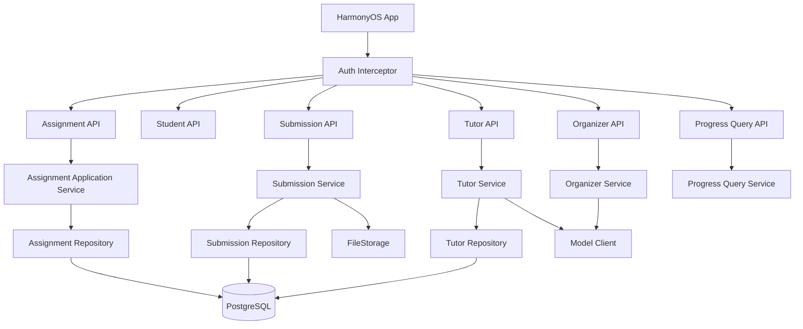
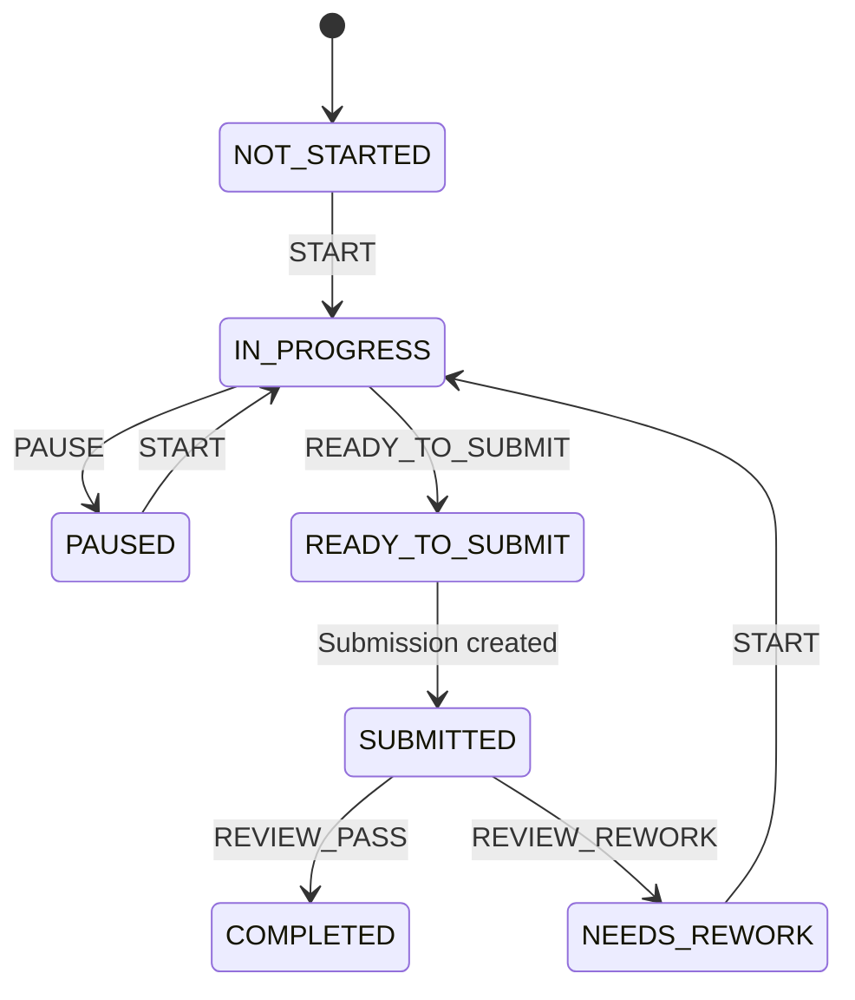

# 小伴作业｜后端技术设计 V2

> 状态：Draft for implementation  
> 产品基线：`docs/product/product-feature-list-v2.md`  
> 技术基线：Java 21 + Spring Boot 4.1.x + PostgreSQL + JPA + Flyway  
> 架构形态：模块化单体

---

## 1. 设计结论

V2 后端继续坚持简单架构：

- 一个 Spring Boot 应用；
- 一个 PostgreSQL；
- 一个本地/对象存储抽象；
- 不引入 Redis；
- 不引入 MQ；
- 不引入 API Gateway；
- 不拆微服务；
- 不引入工作流引擎。

V2 的重点不是增加基础设施，而是把领域模型和接口契约做正确，使 Phone / Pad、新 UI、课内 / 课外、筛选、日历和 AI 辅导都建立在同一套稳定后端能力之上。

---

# 2. 当前基础

当前后端已经具备：

```text
auth
family
student
assignment
submission
organizer
tutor
storage
common
```

已有能力：

- opaque Bearer Session；
- familyId 权限隔离；
- Student CRUD；
- Assignment CRUD；
- Assignment optimistic version；
- Assignment 状态流转与单一进行中任务；
- Submission 多图片上传；
- Tutor session / message；
- OpenAI-compatible 模型适配；
- PostgreSQL + Flyway；
- backend real E2E smoke。

因此 V2 采用 **增量演进**，不重写后端。

---

# 3. V2 后端总体架构



核心规则：

1. Controller 只做 HTTP 协议转换；
2. Service 控制事务和领域规则；
3. JPA Entity 不直接暴露给客户端；
4. familyId 必须进入所有业务查询；
5. 状态流转由后端控制；
6. 聚合统计优先实时查询，不建设统计平台。

---

# 4. 模块边界

## 4.1 auth / family

继续负责：

- 登录；
- Session；
- familyId 注入；
- 家庭配置。

P1 可增加：

```text
FamilyPreference
- tutorGuidanceFirst
- directAnswerAllowed
- notification rules
```

P0 不要求立即迁移现有前端配置。

## 4.2 student

继续作为家庭下的孩子上下文。

所有 Assignment / Submission / Tutor 必须最终可追溯到 studentId。

## 4.3 assignment

V2 核心模块。

负责：

- 课内 / 课外统一模型；
- metadata；
- 状态机；
- 计时；
- 日期；
- resource；
- requirement；
- filter query；
- optimistic concurrency。

## 4.4 submission

从“照片提交”逐步演进为“提交 + 附件”。

P0 仍只开放图片；数据结构预留 audio / video。

## 4.5 organizer

负责老师内容 -> Candidate 结构化。

V2 仍然保持：

> Raw Import / Candidate 在确认前不是核心云端业务实体。

服务端 organizer 可以是无状态 AI 解析接口，不必持久化全部老师原文。

## 4.6 tutor

继续服务端持有模型配置和 Prompt。

V2 增加 Assignment V2 上下文：

- 类型；
- 科目；
- 老师要求；
- 教材；
- resources；
- requirements。

## 4.7 progress

新增轻量 Query Service，不新增独立存储。

职责：

- 今日摘要；
- 本周摘要；
- 待验收；
- 按科目 / 日期查询；
- 家长首页 attention items。

---

# 5. Assignment V2 领域模型

## 5.1 主实体

```text
Assignment
├─ id
├─ familyId
├─ studentId
├─ assignmentType
├─ subjectCode
├─ extracurricularCategory
├─ title
├─ instruction
├─ textbookRef
├─ dueAt
├─ dueTimezone
├─ status
├─ sourceKind
├─ sourceLabel
├─ sourceExcerpt
├─ expectedMinutes
├─ activeStartedAt
├─ elapsedSeconds
├─ finishedAt
├─ reviewNote
├─ version
├─ createdAt
└─ updatedAt
```

### assignmentType

```text
SCHOOL
EXTRA
```

### extracurricularCategory

仅 EXTRA 使用：

```text
NONE
READING
SPEAKING
SPORT
PRACTICE
INTEREST
LIFE
CUSTOM
```

### sourceKind

```text
TEACHER_IMPORT
PARENT_CREATED
AI_RECOMMENDED   // 预留
SYSTEM           // 预留
```

---

# 6. Subject 设计

现有前端 `Subject enum` 只有语文 / 数学 / 英语，不再适合作为长期协议。

V2 API 使用 `subjectCode: string`。

建议内置：

```text
CHINESE
MATH
ENGLISH
SCIENCE
MORALITY_LAW
PE
ART
MUSIC
GENERAL
OTHER
```

客户端负责映射中文展示名称。

优点：

- 不需要每增加一个科目同时升级后端 enum；
- 可以与课外 category 分开；
- 后续支持不同年级科目不会迁移表结构。

P0 仍可限制可接受 code 集合，避免任意字符串污染数据。

---

# 7. Due Date 设计

`dueText` 只适合显示，不适合作为查询主字段。

V2 新增：

```text
due_at timestamptz null
due_timezone varchar(64) not null default 'Asia/Shanghai'
```

服务端返回：

```json
{
  "dueAtEpochMs": 1791739200000,
  "dueTimezone": "Asia/Shanghai",
  "dueText": "10月12日 20:00"
}
```

其中：

- `dueAtEpochMs` 是业务字段；
- `dueText` 是兼容/显示字段，可逐步由客户端格式化；
- 日期筛选全部基于 `due_at`。

---

# 8. 状态模型

## 8.1 Canonical status

目标状态：

```text
NOT_STARTED
IN_PROGRESS
PAUSED
READY_TO_SUBMIT
SUBMITTED
COMPLETED
NEEDS_REWORK
```

## 8.2 OVERDUE 改为派生状态

V2 不建议继续把 `OVERDUE` 作为独立可流转状态保存。

判断：

```text
dueAt < now
AND status NOT IN (COMPLETED, SUBMITTED)
```

得到：

```text
displayState = OVERDUE
```

原因：

- “逾期”是时间事实，不是用户动作；
- 避免定时任务每天修改 status；
- 不需要 scheduler；
- 同一查询时自然得到准确状态。

兼容期允许数据库中存在旧 `OVERDUE`，迁移时转回 `NOT_STARTED` 或原业务状态。

---

# 9. Assignment Action Command

当前客户端可以 PATCH status / startedAt / elapsedSeconds，V2 需要收紧。

## 9.1 Metadata 更新

```http
PATCH /api/v1/assignments/{id}
```

只允许修改：

- title；
- instruction；
- subjectCode；
- assignmentType；
- extracurricularCategory；
- textbookRef；
- dueAt；
- expectedMinutes；
- requirements / resources metadata；
- reviewNote（仅特定角色）。

不允许普通 PATCH 直接修改计时字段。

## 9.2 状态动作接口

```http
POST /api/v1/assignments/{id}/actions
```

请求：

```json
{
  "action": "START",
  "version": 3,
  "note": ""
}
```

Action：

```text
START
PAUSE
READY_TO_SUBMIT
REVIEW_PASS
REVIEW_REWORK
```

状态变化示例：



后端负责：

- 当前时间；
- activeStartedAt；
- elapsedSeconds；
- finishedAt；
- 同一个学生只允许一个 IN_PROGRESS；
- version 检查。

客户端不再自己算最终权威计时。

---

# 10. Resource 模型

新增表：

```text
assignment_resource
- id uuid
- family_id uuid
- assignment_id varchar
- type varchar
- label varchar
- uri varchar/text
- storage_path varchar/text nullable
- content_type varchar nullable
- sort_order int
- created_at timestamptz
```

ResourceType：

```text
TEXTBOOK
FILE
IMAGE
LINK
AUDIO
VIDEO
```

P0：

- textbookRef 继续保留；
- resources 支持 metadata；
- 老师文件真实上传能力可按需求后补。

---

# 11. Requirement 模型

新增表：

```text
assignment_requirement
- id uuid
- family_id uuid
- assignment_id varchar
- content varchar(500)
- sort_order int
- created_at timestamptz
```

P0 只表达“完成要求”，不建设独立 requirement 状态机。

例如：

```text
完成20道口算
拍照保持清晰
提交前检查答案
```

后续如果确实需要逐项勾选，再增加 completion 字段，不提前设计复杂 checklist workflow。

---

# 12. Submission V2

## 12.1 目标结构

```text
submission
- id
- family_id
- assignment_id
- student_id
- type
- submitted_at

submission_attachment
- id
- submission_id
- media_type
- storage_path
- original_name
- content_type
- sort_order
- size_bytes
```

MediaType：

```text
IMAGE
AUDIO
VIDEO
```

P0 仍只开放 IMAGE。

## 12.2 兼容策略

现有：

```text
submission_photo
/submission-photos/{photoId}
```

迁移期间：

- 保留旧 endpoint；
- 新代码内部统一映射到 attachment；
- 待客户端全部迁移后再删除旧 photo 专用模型。

---

# 13. 查询 API

## 13.1 作业列表

```http
GET /api/v1/students/{studentId}/assignments
```

Query：

```text
type=SCHOOL|EXTRA
subject=CHINESE,MATH
from=epochMs
to=epochMs
status=NOT_STARTED,IN_PROGRESS
attention=true|false
overdue=true|false
```

所有参数可选。

P0 不做分页，因为单家庭单孩子每天/每学期数据量很小；后续历史数据增长后再增加 cursor/page。

## 13.2 作业详情

```http
GET /api/v1/assignments/{id}
```

详情响应包含：

- assignment；
- resources；
- requirements；
- latestSubmissionSummary；
- derived flags（overdue / attention）。

## 13.3 Today Summary

```http
GET /api/v1/students/{studentId}/assignments/summary?date=2026-09-16
```

返回：

```json
{
  "total": 5,
  "completed": 3,
  "inProgress": 1,
  "attention": 1,
  "nextAssignmentId": "a-001"
}
```

## 13.4 Calendar

P1：

```http
GET /api/v1/students/{studentId}/assignments/calendar?month=2026-09
```

按日期返回轻量 count，不返回完整 Assignment。

---

# 14. Repository 查询设计

`AssignmentRepository` 增加 Specification / 显式 query method，但不要做通用动态 SQL 框架。

推荐：

```text
AssignmentQuery
- familyId
- studentId
- assignmentType?
- subjectCodes?
- from?
- to?
- statuses?
- overdue?
```

Service 将 query 转成 JPA Specification。

如果为了保持代码更轻，也可以先实现少量固定 repository query + service 内存二次过滤；但日期和家庭隔离必须下推数据库。

---

# 15. 数据库索引

V2 建议：

```sql
create index idx_assignment_family_student_due
  on assignment(family_id, student_id, due_at);

create index idx_assignment_family_student_type_due
  on assignment(family_id, student_id, assignment_type, due_at);

create index idx_assignment_family_student_status
  on assignment(family_id, student_id, status, updated_at desc);
```

不为每个 filter 组合建立索引。

单家庭数据量不大，避免过度优化。

---

# 16. 家长导入与 Candidate

V2 仍保持：

```text
Raw teacher content
  -> OCR / organizer
  -> CandidateAssignment
  -> parent confirm
  -> Assignment
```

Candidate 不需要成为后端强实体。

## 16.1 Organizer API

保持无状态：

```http
POST /api/v1/organizer/parse
```

输入：

- rawText；
- student context；
- optional source metadata。

输出：

- candidates；
- confidence；
- source evidence。

## 16.2 批量发布

建议新增：

```http
POST /api/v1/students/{studentId}/assignments/batch
```

请求包含确认后的多个 Assignment。

要求：

- 一个事务；
- ID 幂等；
- 已存在同 ID 返回现有对象；
- 避免发布 4 项只成功 2 项。

---

# 17. 课外作业

课外作业不建设独立服务。

家长创建：

```http
POST /api/v1/students/{studentId}/assignments
```

示例：

```json
{
  "assignmentType": "EXTRA",
  "extracurricularCategory": "READING",
  "subjectCode": "GENERAL",
  "title": "阅读一本喜欢的书",
  "instruction": "阅读后写50字感受",
  "dueAtEpochMs": 1791835200000,
  "expectedMinutes": 30,
  "sourceKind": "PARENT_CREATED"
}
```

课内 / 课外后续所有状态、提交、Tutor 都复用同一链路。

---

# 18. Tutor V2

现有：

```text
TutorController
 -> TutorService
 -> TutorModelClient
 -> OpenAI-compatible API
```

该结构保留。

## 18.1 Context Builder

`TutorPromptBuilder` 输入扩展：

```text
Student
Assignment
Assignment Resources
Assignment Requirements
Conversation History
Family Tutor Policy
Current Question
```

## 18.2 安全与产品规则

- 模型 key 永不下发客户端；
- `store=false` 保持；
- 模型不可用不影响作业流程；
- guidance-first 是默认；
- 家长未允许时，不直接输出可抄写完整答案；
- Tutor Message 仍存本地 PostgreSQL 便于家庭查看使用记录。

## 18.3 P1 家庭配置服务端化

将：

```text
guidanceFirst
directAnswerAllowed
```

从每次 ask 请求迁移到 FamilyPreference。

---

# 19. Progress Query

新增 `ProgressQueryService`，但不新增 progress 表。

实时从：

```text
assignment
submission
tutor_session
```

计算：

- completed count；
- in progress；
- overdue；
- needs rework；
- submitted / waiting review；
- AI used；
- elapsed time。

单家庭规模下，这比维护异步统计表更简单可靠。

---

# 20. 多孩子与家庭隔离

所有业务必须同时校验：

```text
familyId from AuthInterceptor
student belongs to family
assignment belongs to family
submission belongs to family
```

Controller 不接受客户端传 familyId。

Repository 查询必须优先包含 familyId，禁止先 findById 后只靠 UI 隔离。

当前 `requireOwned()` 模式继续保留。

---

# 21. 并发与多设备

继续使用 JPA `@Version`。

规则：

- metadata patch 要求 version；
- action command 要求 version；
- 409 时客户端刷新；
- Submission 创建由服务端事务推进 Assignment -> SUBMITTED；
- Parent review 同样由 action command 推进。

不做：

- CRDT；
- field-level merge；
- 分布式锁。

---

# 22. 时间与计时

数据库使用：

```text
Instant / timestamptz
```

客户端展示使用 epochMs 或 ISO8601。

计时规则：

- START：服务端写 active_started_at；
- PAUSE：累计 elapsed_seconds；
- READY_TO_SUBMIT：累计 elapsed_seconds，清空 active_started_at；
- 同学生启动新作业：服务端自动 pause 旧 IN_PROGRESS；
- 客户端倒计时仅用于 UI；最终 elapsed 以服务端为准。

---

# 23. File Storage

继续使用 `FileStorage` 抽象。

P0：LocalFileStorage。

未来部署需要对象存储时新增：

```text
S3FileStorage / OBSFileStorage
```

业务 Service 不修改。

禁止直接把公开文件 URL 存入 Assignment 并永久暴露。

下载仍经过鉴权 API 或后续签名 URL。

---

# 24. API 错误契约

继续使用统一异常处理。

建议稳定错误 code：

```text
NOT_FOUND
VALIDATION_ERROR
VERSION_CONFLICT
INVALID_STATE_TRANSITION
AUTH_REQUIRED
FORBIDDEN
UPLOAD_FAILED
AI_UNAVAILABLE
```

响应：

```json
{
  "code": "VERSION_CONFLICT",
  "message": "作业已在其他设备更新，请刷新后重试",
  "requestId": "..."
}
```

前端不根据中文 message 判断错误类型。

---

# 25. Flyway 迁移建议

当前已有 V1~V6。

建议：

## V7__assignment_v2.sql

新增：

```text
assignment_type
subject_code
extracurricular_category
source_kind
due_at
due_timezone
active_started_at
```

并迁移旧 subject / timing。

## V8__assignment_resource_requirement.sql

新增：

```text
assignment_resource
assignment_requirement
```

## V9__submission_attachment.sql

新增通用 attachment，并迁移 submission_photo。

P0 可以只实施 V7 + V8；V9 在音视频提交进入开发时再做。

---

# 26. API 兼容策略

不要一次破坏现有 App。

迁移期：

1. Response 同时返回旧字段 `subject/dueText/startedAtEpochMs` 和 V2 字段；
2. 新前端优先使用 V2 字段；
3. PATCH 暂时兼容旧 timing 字段，但打印 deprecated 日志；
4. 新前端切换到 action API 后，再删除旧 client-writable timing；
5. E2E smoke 同时覆盖兼容 API 和 V2 API。

---

# 27. 测试设计

## 27.1 Domain / Service Test

必须覆盖：

- SCHOOL / EXTRA；
- subject filter；
- date range；
- derived overdue；
- only one IN_PROGRESS；
- START / PAUSE timing；
- READY_TO_SUBMIT；
- Submission -> SUBMITTED；
- REVIEW_PASS；
- REVIEW_REWORK；
- optimistic conflict；
- family isolation。

## 27.2 Repository Integration Test

使用 PostgreSQL/Testcontainers 或当前真实 DB 测试策略，重点覆盖 V7 migration 和 filter query。

## 27.3 Real E2E Smoke V2

现有 `backend/scripts/e2e_smoke.py` 扩展：

```text
login
create student
batch publish SCHOOL assignments
create EXTRA assignment
filter by subject/date/type
start assignment
pause
resume
submit photos
review pass/rework
Tutor fallback/available
restart backend + session resume
```

---

# 28. 可观测性

维持轻量：

- requestId；
- AccessLog；
- API latency；
- AI provider latency / status；
- upload failure；
- version conflict count。

不引入 tracing platform。

日志禁止包含：

- password；
- bearer token；
- API key；
- 作业照片二进制；
- 完整 AI provider credential。

---

# 29. 后端实施顺序

## Phase B0｜Assignment V2 基础

1. V7 migration；
2. AssignmentEntity / DTO V2；
3. dueAt；
4. type / subjectCode / category；
5. filter API；
6. derived overdue；
7.兼容旧字段。

## Phase B1｜Command API

1. AssignmentAction DTO；
2. state command endpoint；
3. server-authoritative timing；
4. client timing 字段 deprecated；
5. batch publish。

## Phase B2｜Resource / Requirement

1. V8 tables；
2. Assignment detail；
3. Tutor context；
4. parent import publish mapping。

## Phase B3｜Progress / Extra

1. ProgressQueryService；
2. today summary；
3. parent attention；
4. calendar P1；
5. parent extracurricular create。

## Phase B4｜Submission generalized

音频 / 视频进入需求后再实施 V9。

---

# 30. 后端技术验收标准

1. 继续保持单 Spring Boot + PostgreSQL；
2. Assignment 同时支持 SCHOOL / EXTRA；
3. 按 type + subject + date + status 可查询；
4. due date 使用结构化字段；
5. OVERDUE 不依赖定时任务即可准确计算；
6. 状态和权威计时由后端 action 控制；
7. 多设备冲突继续通过 version=409 处理；
8. Submission 创建自动推进作业状态；
9. family / student 数据不能串；
10. Tutor 使用 Assignment V2 上下文；
11. 后端未配置 AI 时作业主链正常；
12. 不新增 Redis/MQ/微服务等非必要基础设施。

---

## 31. 参考

- 产品特性：`docs/product/product-feature-list-v2.md`
- 当前 Backend：`backend/README.md`
- 当前 Assignment：`backend/src/main/java/com/xiaoban/homework/assignment/`
- 当前 Submission：`backend/src/main/java/com/xiaoban/homework/submission/`
- 当前 Tutor：`backend/src/main/java/com/xiaoban/homework/tutor/`
- 当前 Flyway：`backend/src/main/resources/db/migration/`
