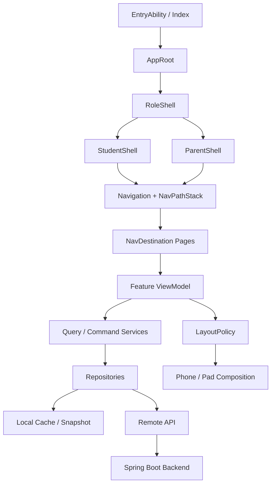

# 小伴作业｜前端技术设计 V2

> 状态：Draft for implementation  
> 适用范围：HarmonyOS Phone / Pad 前端全面重构  
> 产品基线：`docs/product/product-feature-list-v2.md`  
> 技术基线：ArkTS + ArkUI，兼容当前 HarmonyOS 6.0.0(20) 运行基线

---

## 1. 设计目标

V2 前端不是对现有页面继续做样式修补，而是围绕新的产品原型重构页面组合、导航、状态边界和数据访问方式。

目标：

1. Phone 核心流程稳定单列，不再因为窗口分类错误进入左右分栏；
2. Pad 在真实可用空间足够时提供列表 + 详情、学习内容 + AI 小伴等增强布局；
3. 作业天然支持课内 / 课外、科目、日期、状态组合筛选；
4. 学生端围绕“下一项作业”组织，家长端围绕“异常、导入、验收”组织；
5. 页面只依赖 ViewModel / Repository，不直接操作远端 API；
6. 本地仍支持离线读取和弱网操作，但服务端是跨设备共享数据源；
7. 不引入 Redux、MobX 等重型状态管理框架。

---

## 2. 现状与需要解决的问题

当前代码已经具备良好基础：

- `domain/`：领域模型与状态机；
- `application/`：导入、提交、远端 API、Tutor；
- `data/HomeworkStore.ets`：本地状态和持久化入口；
- `features/`：学生端 / 家长端页面；
- `components/`：部分可复用 UI；
- `Navigation + NavPathStack` 已存在；
- 本地快照 + 远端同步已形成基本闭环。

但 V2 重构前有四个结构性问题：

### 2.1 AppShell 承担过多路由职责

当前 `AppShell` 同时维护角色、页面枚举、详情返回页、选中作业、尺寸分类和导航形态。页面跳转主要通过 `StudentRoute / ParentRoute` 条件渲染实现。

问题：

- 路由状态集中在一个组件；
- 列表 / 详情组合与页面导航强耦合；
- Phone / Pad 页面难以独立组合；
- 深层页面继续增加后，`AppShell` 会越来越大。

### 2.2 HomeworkStore 逐渐成为万能 Store

当前 Store 同时保存：

- students；
- rawImports；
- candidates；
- assignments；
- submissions；
- tutorSessions；
- activeStudent；
- 持久化；
- assignment 状态流转；
- summary 查询。

V2 增加日历、组合筛选、课外作业、家长验收后，如果继续扩展单一 Store，会进一步放大耦合。

### 2.3 UI 直接依赖领域对象与同步细节

页面目前经常直接访问 `HomeworkStore.instance`，并通过 `revision` 手工触发刷新；远端同步仍围绕整份 active student assignment 列表进行。

问题：

- 页面难以单测；
- UI 状态与领域状态混在一起；
- 筛选、分页、加载、错误、选择态没有明确归属；
- 多页面修改同一 Assignment 时容易出现刷新耦合。

### 2.4 响应式仍然过度依赖 sizeClass

V2 产品原则已经改成：

> 是否多栏由“当前内容容器实际可用宽度 + 每个内容区最小可读宽度”决定，而不是 Phone / Pad 型号。

因此，`WindowSizeClass` 可以继续用于导航形态，但不能继续作为所有业务页面的布局决定因素。

---

# 3. 前端总体架构



核心原则：

- **页面只负责呈现与交互；**
- **ViewModel 负责页面状态；**
- **Repository 负责本地 / 远端数据；**
- **Command Service 负责状态流转；**
- **LayoutPolicy 负责容器级布局能力；**
- **Navigation 负责页面生命周期与系统返回。**

---

# 4. 建议目录结构

```text
entry/src/main/ets/
├─ app/
│  ├─ AppRoot.ets
│  ├─ RoleShell.ets
│  ├─ StudentShell.ets
│  ├─ ParentShell.ets
│  └─ navigation/
│     ├─ AppRoutes.ets
│     ├─ RouteParams.ets
│     └─ AppNavDestination.ets
│
├─ domain/
│  ├─ model/
│  │  ├─ Assignment.ets
│  │  ├─ AssignmentFilter.ets
│  │  ├─ Submission.ets
│  │  └─ StudentProfile.ets
│  ├─ service/
│  │  ├─ AssignmentOrdering.ets
│  │  └─ AssignmentDisplayPolicy.ets
│  └─ port/
│     ├─ AssignmentRepository.ets
│     ├─ StudentRepository.ets
│     └─ SubmissionRepository.ets
│
├─ data/
│  ├─ local/
│  │  ├─ LocalSnapshotRepository.ets
│  │  └─ LocalPreferences.ets
│  ├─ remote/
│  │  ├─ AssignmentRemoteDataSource.ets
│  │  ├─ SubmissionRemoteDataSource.ets
│  │  └─ TutorRemoteDataSource.ets
│  └─ repository/
│     ├─ AssignmentRepositoryImpl.ets
│     ├─ StudentRepositoryImpl.ets
│     └─ SubmissionRepositoryImpl.ets
│
├─ application/
│  ├─ assignment/
│  │  ├─ AssignmentQueryService.ets
│  │  ├─ AssignmentCommandService.ets
│  │  └─ AssignmentSyncCoordinator.ets
│  ├─ import/
│  ├─ submission/
│  └─ tutor/
│
├─ features/
│  ├─ student/
│  │  ├─ home/
│  │  ├─ assignments/
│  │  ├─ assignmentdetail/
│  │  ├─ study/
│  │  ├─ tutor/
│  │  ├─ learning/
│  │  └─ profile/
│  └─ parent/
│     ├─ home/
│     ├─ import/
│     ├─ confirmation/
│     ├─ progress/
│     ├─ review/
│     ├─ extracurricular/
│     └─ settings/
│
├─ presentation/
│  ├─ components/
│  ├─ theme/
│  └─ responsive/
│     ├─ LayoutCapability.ets
│     └─ LayoutPolicy.ets
│
└─ infrastructure/
   ├─ network/
   ├─ persistence/
   └─ logging/
```

说明：第一阶段不要求一次性搬完目录，可通过 facade 逐步迁移；但新页面禁止继续直接扩展旧 `HomeworkStore`。

---

# 5. 导航技术设计

## 5.1 使用 Navigation / NavDestination 作为正式路由体系

V2 不再通过一个大 `if/else` 枚举切换所有页面。

建议路由：

```text
/student/home
/student/assignments
/student/assignment/detail
/student/study
/student/tutor
/student/learning
/student/profile

/parent/home
/parent/import/source
/parent/import/candidates
/parent/import/confirm
/parent/progress
/parent/assignment/review
/parent/extracurricular/create
/parent/settings
```

Route 参数统一使用 typed object：

```ts
export interface AssignmentRouteParam {
  assignmentId: string;
}

export interface StudentRouteContext {
  studentId: string;
}
```

禁止把 Assignment 对象本身塞进路由参数；详情页只传 `assignmentId`，进入页面后通过 Repository 获取最新数据。

## 5.2 Shell 与业务页面职责分离

`StudentShell / ParentShell` 只负责：

- 一级导航；
- 当前角色；
- 当前孩子上下文；
- Navigation 容器；
- Phone 底部导航 / Pad 侧边导航。

Shell 不再负责：

- 具体 Assignment 状态；
- 当前详情业务状态；
- Tutor 对话状态；
- Import candidate 编辑状态。

## 5.3 系统返回

所有详情页由 `NavPathStack.pop()` 返回。

不再由 `AppShell` 手写：

```text
STUDY -> TODAY
CONFIRMATION -> IMPORT
```

这样系统返回、页面返回按钮和深层导航保持一致。

---

# 6. 状态管理设计

V2 不引入第三方状态框架，采用轻量三层状态：

## 6.1 App Session State

负责全局但很少变化的状态：

```ts
interface AppSessionState {
  role: AppRole;
  activeStudentId: string;
  backendConnected: boolean;
  accountDisplayName: string;
}
```

只允许 Shell 和跨页面服务访问。

## 6.2 Domain Cache State

由 Repository 维护：

- Student cache；
- Assignment cache；
- Submission metadata cache；
- Tutor conversation cache；
- 本地未发布 Import Candidate。

页面不直接修改 cache。

## 6.3 Page ViewModel State

每个页面自己维护：

```ts
interface AssignmentListState {
  loading: boolean;
  refreshing: boolean;
  errorMessage: string;
  filter: AssignmentFilter;
  items: AssignmentListItemModel[];
  selectedAssignmentId: string;
}
```

这类状态不进入全局 Store。

---

# 7. Assignment 前端领域模型 V2

现有 `Assignment` 需要升级，但保留一个统一主模型，不另建 ExtraHomework。

```ts
export enum AssignmentType {
  SCHOOL = 'SCHOOL',
  EXTRA = 'EXTRA'
}

export enum ExtracurricularCategory {
  NONE = 'NONE',
  READING = 'READING',
  SPEAKING = 'SPEAKING',
  SPORT = 'SPORT',
  PRACTICE = 'PRACTICE',
  INTEREST = 'INTEREST',
  LIFE = 'LIFE',
  CUSTOM = 'CUSTOM'
}

export interface Assignment {
  id: string;
  studentId: string;
  assignmentType: AssignmentType;
  subjectCode: string;
  extracurricularCategory: ExtracurricularCategory;
  title: string;
  instruction: string;
  textbookRef: string;
  dueAtEpochMs: number;
  dueTimezone: string;
  status: AssignmentStatus;
  expectedMinutes: number;
  elapsedSeconds: number;
  reviewNote: string;
  version: number;
  resources: AssignmentResource[];
  requirements: AssignmentRequirement[];
}
```

关键变化：

1. `dueText` 不再作为业务判断依据，只作为兼容字段；
2. 新增 `dueAtEpochMs`，筛选、逾期、日历全部基于结构化时间；
3. `subject` 改成可扩展 code，不使用只能覆盖语数英的 enum；
4. `assignmentType` 统一课内 / 课外；
5. 课外分类独立字段，不污染学科字段；
6. resource / requirement 结构化，而不是只存字符串列表。

---

# 8. 筛选与查询模型

统一前后端筛选契约：

```ts
export interface AssignmentFilter {
  assignmentType: AssignmentType | null;
  subjectCodes: string[];
  fromEpochMs: number;
  toEpochMs: number;
  statuses: AssignmentStatus[];
}
```

提供预设：

- TODAY；
- TOMORROW；
- THIS_WEEK；
- OVERDUE；
- ALL。

Phone 顶部只展示：

```text
日期入口 + 筛选入口 + 科目 chips
```

复杂条件进入 Bottom Sheet。

Pad 可将筛选区持久化显示，但筛选状态和 Phone 共用同一 `AssignmentFilter`。

---

# 9. 页面技术结构

## 9.1 学生首页

ViewModel：`StudentHomeViewModel`

输出：

```ts
interface StudentHomeUiState {
  todayCompleted: number;
  todayTotal: number;
  nextAssignment: AssignmentSummary | null;
  remaining: AssignmentSummary[];
  attentionItems: AssignmentSummary[];
}
```

排序由 `AssignmentOrdering` 完成：

1. NEEDS_REWORK / OVERDUE；
2. IN_PROGRESS / PAUSED；
3. 当天截止；
4. 明天截止；
5. 其他。

页面不得自己复制排序逻辑。

## 9.2 作业列表

`StudentAssignmentsViewModel` 负责：

- filter；
- list mode；
- calendar mode；
- selected assignment；
- refresh。

Phone：列表点击 push 详情页。

Pad：如果容器满足 master-detail 能力，则列表选中后右侧显示 `AssignmentDetailPane`；否则行为与 Phone 相同。

## 9.3 学习空间

拆成三个独立组件：

```text
StudyTaskPane
StudyResourcePane
TutorPane
```

Phone：

```text
StudyPage
  ├─ Task + Resource
  ├─ 固定底部主动作
  └─ 问小伴 -> push / dialog destination
```

Pad：

```text
StudyWorkspace
  └─ Task + Resource

点击问小伴且容器满足 capability 后：
StudyWorkspace
  ├─ Task + Resource
  └─ TutorPane
```

特别宽时可增加 Task Rail，但不是 P0 必须。

## 9.4 家长导入

导入流程改成真正的三步流程对象：

```ts
interface ImportFlowState {
  step: SOURCE | ORGANIZE | CONFIRM;
  source: RawHomeworkImport;
  candidates: CandidateAssignment[];
  organizing: boolean;
  dirty: boolean;
}
```

Phone 始终连续页面。

Pad 即使空间足够，也只允许在同一步骤内部增强并排展示，不改变业务步骤。

## 9.5 家长进度 / 验收

列表查询和详情验收拆开：

```text
ParentProgressPage
ParentAssignmentReviewPage
```

Phone：页面跳转。

Pad：可组合为 master-detail，但 `ParentAssignmentReviewPage` 仍然可以独立运行。

---

# 10. 响应式技术设计

## 10.1 不再让业务页面直接判断 COMPACT / MEDIUM / EXPANDED

窗口 size class 只用于：

- 底部导航还是侧边导航；
- 大致页面 padding；
- Shell 级行为。

业务布局使用：

```ts
export interface LayoutRequirement {
  primaryMinWidth: number;
  secondaryMinWidth: number;
  gap: number;
  horizontalPadding: number;
}

export class LayoutPolicy {
  static canSplit(availableWidthVp: number, requirement: LayoutRequirement): boolean {
    return availableWidthVp >=
      requirement.primaryMinWidth +
      requirement.secondaryMinWidth +
      requirement.gap +
      requirement.horizontalPadding * 2;
  }
}
```

这里的数字是“内容最小可读尺寸”，不是设备断点。

## 10.2 每个组合定义自己的能力

示例：

```text
Assignment Master-Detail
- list min: 320vp
- detail min: 420vp
- gap: 1~16vp

Study + Tutor
- study min: 480vp
- tutor min: 320vp
- gap: 16vp

Parent Review
- list min: 340vp
- detail min: 440vp
```

不同页面不再共用一个全局“840vp = 双栏”。

## 10.3 容器宽度来源

当前 API 20 基线继续使用容器自身 `onAreaChange` 获取实际宽度，并统一通过 `Area.width -> vp` 解析方法进入 `LayoutPolicy`。

未来最低 API 升级后，可将测量实现替换为 ContainerReader，但页面不需要改，因为页面只依赖 `LayoutCapability`。

## 10.4 Navigation 自适应

Shell 可继续使用系统 Navigation 的单栏 / 分栏 / 自适应能力，但业务页面的 master-detail 不直接绑定 Navigation 的窗口模式。

---

# 11. Repository 与同步设计

## 11.1 Repository 是 UI 唯一数据入口

```ts
export interface AssignmentRepository {
  list(studentId: string, filter: AssignmentFilter): Promise<Assignment[]>;
  get(id: string): Promise<Assignment | null>;
  refresh(studentId: string): Promise<void>;
  saveDraft(assignment: Assignment): Promise<void>;
}
```

UI 不再调用：

```text
HomeworkRemoteApi.instance
HomeworkStore.instance.replaceAssignmentsForActiveStudent(...)
```

## 11.2 服务端优先、本地缓存

V2 继续保持：

- 服务端：跨设备最终共享源；
- 本地：离线读取与 UI cache；
- 未确认的老师原文 / candidates：优先保留本地；
- 已发布 Assignment：进入云端。

## 11.3 同步粒度改进

当前同步每次拉整份 Assignment 列表，V2 P0 可以保留，不急于做增量同步。

但写操作改为 Command：

```text
startAssignment
pauseAssignment
markReadyToSubmit
submitAssignment
reviewPass
reviewRework
updateMetadata
```

这样同步冲突不再依赖 UI 任意修改 status / timing 字段。

---

# 12. Command Service

```ts
export class AssignmentCommandService {
  async start(id: string): Promise<Assignment>;
  async pause(id: string): Promise<Assignment>;
  async readyToSubmit(id: string): Promise<Assignment>;
  async reviewPass(id: string): Promise<Assignment>;
  async reviewRework(id: string, note: string): Promise<Assignment>;
}
```

Command Service 负责：

1. 乐观更新 UI；
2. 调后端 action API；
3. 更新 local cache；
4. 409 时刷新实体并给页面返回冲突提示；
5. 弱网时对允许离线的动作标记 dirty。

P0 不做通用离线命令队列；只允许当前已有的轻量 dirty 机制演进。

---

# 13. UI 组件体系

## 13.1 基础组件

```text
AppPage
AppTopBar
PrimaryButton
SecondaryButton
StatusChip
SubjectChip
EmptyState
ErrorState
LoadingState
BottomActionBar
FilterChipBar
FilterSheet
```

## 13.2 业务组件

```text
AssignmentSummaryCard
AssignmentListItem
AssignmentFilterBar
AssignmentCalendar
AssignmentRequirementList
AssignmentResourceList
AssignmentStatusBadge
SubmissionPhotoStrip
TodayProgressCard
NextAssignmentCard
TutorMessageList
TutorComposer
```

要求：

- Feature Page 只能组合组件，不复制卡片样式；
- 学科色从 Theme / SubjectVisualPolicy 获取；
- 不允许页面自己硬编码颜色和圆角；
- 触控区域统一 >= 40vp；
- 正常正文对比度保持 >= 4.5:1。

---

# 14. Theme V2

现有 `AppTheme` 保留，但拆成：

```text
ColorTokens
TypographyTokens
SpacingTokens
RadiusTokens
ComponentTokens
SubjectVisualPolicy
```

P0 目标不是设计系统工程化，而是避免所有页面继续直接堆静态常量。

资源色和 dark mode 进入 P1，不阻塞 V2 页面重构。

---

# 15. AI 小伴前端设计

Tutor 前端只负责交互，不包含模型策略。

输入：

- assignmentId；
- 当前 tutor conversation；
- 图片 OCR 结果；
- 用户文本。

输出：

- user / assistant message；
- availability；
- notice；
- loading / sending state。

AI 小伴页面不直接构造 system prompt。

当前家长的 `guidanceFirst / directAnswerAllowed` 作为配置传给后端，最终策略以后逐步改为后端家庭设置统一控制。

---

# 16. 错误与降级策略

必须统一处理：

| 场景 | UI 行为 |
|---|---|
| 后端未连接 | 显示本地缓存，顶部轻提示 |
| 拉取失败 | 保留旧内容，可手动刷新 |
| 409 version conflict | 自动刷新当前 Assignment，提示“已更新” |
| Tutor 未配置 | Tutor 页面显示不可用，作业流程不受影响 |
| 照片上传失败 | 本地照片保留，允许重试 |
| OCR 失败 | 回到手工编辑，不阻塞导入 |

禁止把整页变成错误页，除非页面确实没有任何可展示数据。

---

# 17. 测试策略

## 17.1 ViewModel 单测

重点覆盖：

- 下一项排序；
- 科目 + 日期 + 类型组合筛选；
- 课内 / 课外；
- 逾期；
- 状态分组；
- 409 refresh；
- 多孩子切换隔离。

## 17.2 UI 静态门禁

新增 V2 门禁：

- Phone 核心页面不得直接调用 `PadLayout()`；
- Feature Page 不允许自己定义全局响应断点；
- 所有双栏入口必须调用 `LayoutPolicy.canSplit()`；
- Assignment list 页必须存在 type / subject / date filter；
- route 必须通过 Navigation / NavDestination。

## 17.3 DevEco 真实验收

GitHub CI 无法替代 ArkUI 真机 / Preview 编译，必须手工覆盖：

1. Phone portrait；
2. Phone landscape；
3. Pad portrait；
4. Pad landscape；
5. Pad split window；
6. 字体放大；
7. 键盘弹起；
8. 系统返回。

---

# 18. V2 前端迁移顺序

## Phase F0｜基础设施

1. 新 Navigation route registry；
2. `AppSessionState`；
3. Repository interface；
4. `LayoutPolicy`；
5. V2 domain model；
6. 新 UI token / 公共组件。

## Phase F1｜学生主链

1. 学生首页；
2. 作业列表 + 筛选；
3. 作业详情；
4. 学习空间；
5. AI 小伴；
6. 提交。

## Phase F2｜家长主链

1. 家长首页；
2. Import 三步流；
3. Progress；
4. Review；
5. 课外任务创建入口。

## Phase F3｜Pad 增强

1. Assignment master-detail；
2. Study + Tutor；
3. Parent progress + review；
4. Calendar + extracurricular。

---

# 19. 明确不做

V2 前端阶段不引入：

- Redux / MobX；
- 前端 GraphQL client；
- 通用工作流引擎；
- 前端复杂事件总线；
- CRDT；
- Phone / Pad 两套完全独立代码库；
- 大量 device model 判断。

---

# 20. 前端技术验收标准

1. `AppShell` 不再保存具体业务页面枚举状态；
2. 详情页面通过 Navigation/NavDestination 进入；
3. 新页面不直接读写旧 `HomeworkStore`；
4. Assignment 查询统一经过 Repository；
5. Phone 核心页面在任意窄窗口都可完整单列运行；
6. 所有多栏都由当前容器宽度 + 内容最小宽度动态判断；
7. 学生作业页支持类型 + 科目 + 日期过滤；
8. 课外作业复用同一个 Assignment 主模型；
9. 网络断开时仍可查看最近同步作业；
10. Pad 增强布局不影响同一路由在 Phone 上独立运行。

---

## 21. 参考

- 产品基线：`docs/product/product-feature-list-v2.md`
- 现有 UI 方向：`docs/product/ui-design-v1.md`
- Phone / Pad ADR：`docs/adr/0001-phone-pad-ui-composition.md`
- 现有领域模型：`entry/src/main/ets/domain/model/HomeworkModels.ets`
- 现有 Store：`entry/src/main/ets/data/HomeworkStore.ets`
- 现有同步：`entry/src/main/ets/application/remote/HomeworkSyncService.ets`
- Huawei ArkUI Navigation / NavDestination 官方文档
