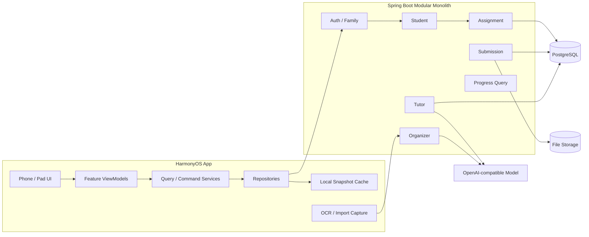
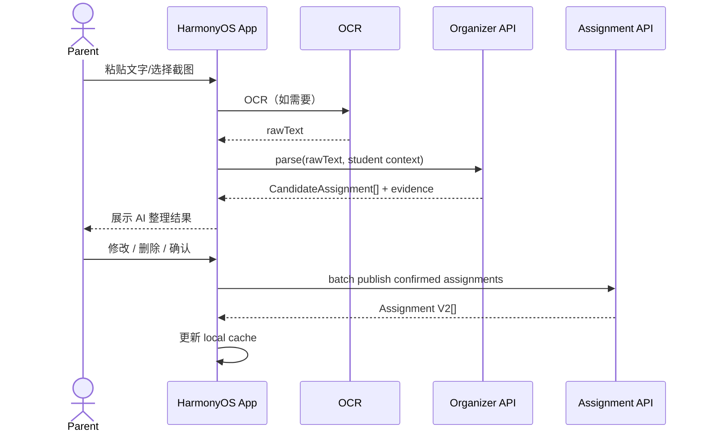
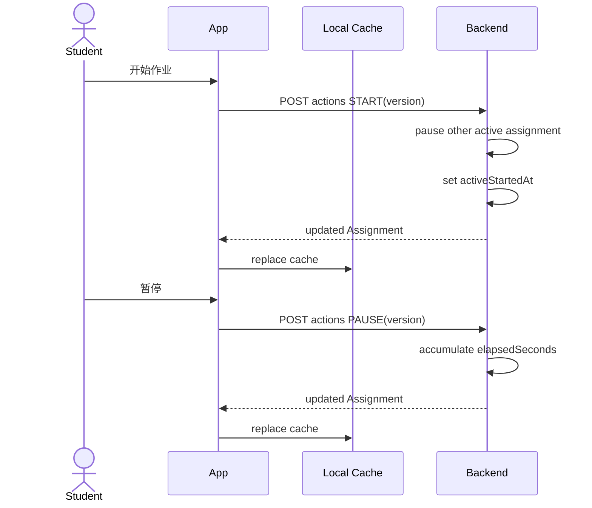
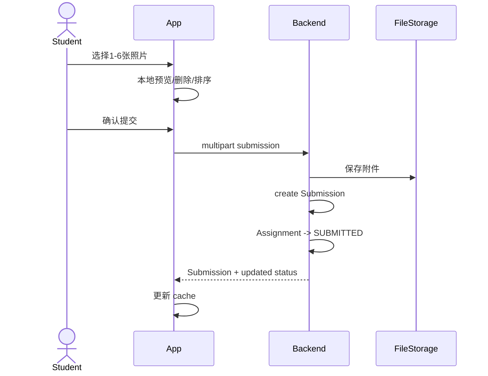
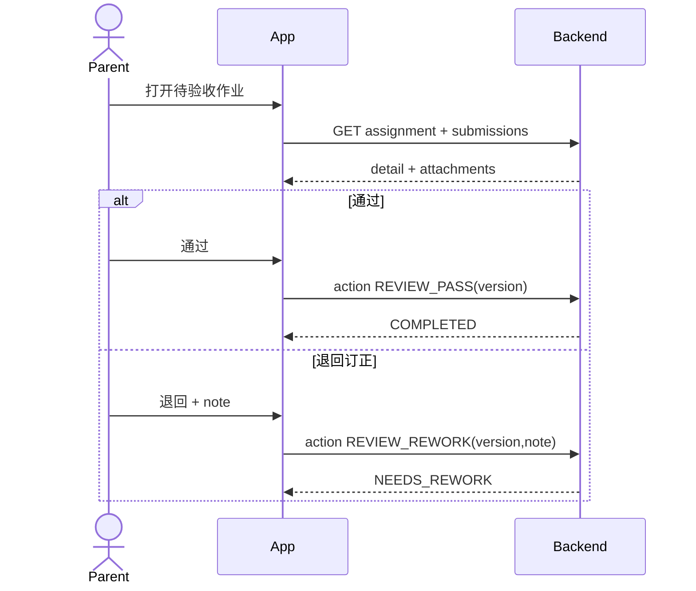
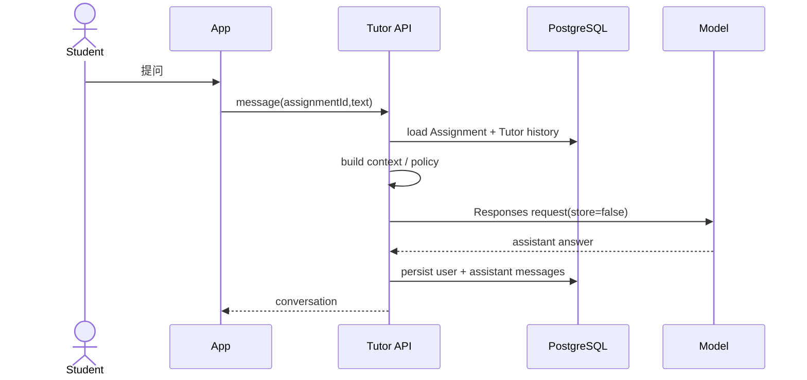
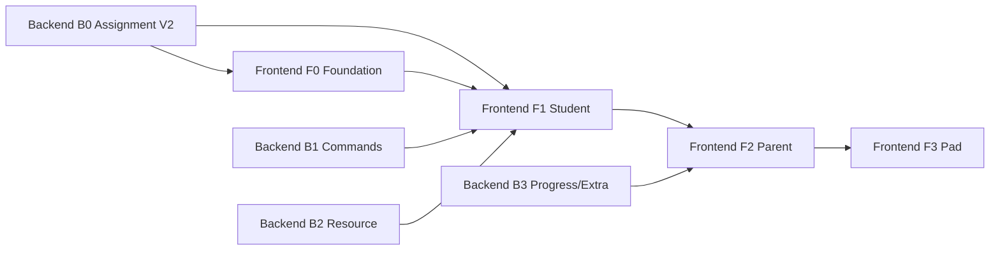

# 小伴作业｜前后端总体技术设计 V2

> 状态：Draft for implementation  
> 关联产品：`docs/product/product-feature-list-v2.md`  
> 前端设计：`docs/architecture/frontend-technical-design-v2.md`  
> 后端设计：`docs/architecture/backend-technical-design-v2.md`

---

## 1. 一句话架构

V2 继续采用：

> **HarmonyOS 原生前端 + Spring Boot 模块化单体 + PostgreSQL + 服务端 AI Provider**

不增加不必要基础设施，通过重新定义 Assignment 领域模型、导航/状态边界和 API Command/Query 契约支撑 UI 全面重构。

---

# 2. 总体架构



---

# 3. 数据所有权

## 3.1 服务端权威数据

确认发布后，以下数据以服务端为跨设备权威源：

- Student；
- Assignment；
- Assignment status / timing；
- Submission metadata；
- Submission attachments；
- Tutor sessions / messages；
- Parent review result；
- Family preferences（P1）。

## 3.2 客户端优先数据

以下内容在发布前可只保存在本地：

- 老师原始消息；
- OCR 中间结果；
- CandidateAssignment；
- Import Flow 编辑态；
- 页面筛选状态；
- ViewModel UI 状态。

这样避免把大量未经确认的老师原文同步到云端，也保持当前产品边界简单。

---

# 4. Assignment V2 统一契约

前后端统一语义：

```text
Assignment
- id
- studentId
- assignmentType: SCHOOL | EXTRA
- subjectCode
- extracurricularCategory
- title
- instruction
- textbookRef
- dueAtEpochMs
- dueTimezone
- status
- overdue (derived)
- expectedMinutes
- elapsedSeconds
- activeStartedAtEpochMs
- reviewNote
- version
- resources[]
- requirements[]
```

原则：

1. 课内 / 课外不分两套模型；
2. `dueText` 只用于兼容 / 展示，不用于业务筛选；
3. `OVERDUE` 是派生显示状态；
4. `status / timing` 不能由客户端任意写；
5. version 是跨设备并发控制依据。

---

# 5. API 分层

## 5.1 Query API

用于读取：

```text
GET /api/v1/students
GET /api/v1/students/{studentId}/assignments
GET /api/v1/assignments/{id}
GET /api/v1/students/{studentId}/assignments/summary
GET /api/v1/students/{studentId}/assignments/calendar       P1
GET /api/v1/assignments/{id}/submissions
GET /api/v1/assignments/{id}/tutor
```

## 5.2 Command API

用于状态变化：

```text
POST  /api/v1/students/{studentId}/assignments
POST  /api/v1/students/{studentId}/assignments/batch
PATCH /api/v1/assignments/{id}
POST  /api/v1/assignments/{id}/actions
POST  /api/v1/assignments/{id}/submissions
POST  /api/v1/assignments/{id}/tutor/messages
```

Query 与 Command 在代码中分开，HTTP 不必引入 CQRS 框架。

---

# 6. 作业查询契约

请求示例：

```http
GET /api/v1/students/s-001/assignments?type=SCHOOL&subject=MATH&from=1791667200000&to=1792271999999
```

前端 `AssignmentFilter` 与 API 一一映射：

```text
assignmentType -> type
subjectCodes   -> subject
fromEpochMs    -> from
toEpochMs      -> to
statuses       -> status
```

禁止 Phone 和 Pad 各自定义一套筛选逻辑。

---

# 7. 家长导入时序



关键点：

- Candidate 不是正式云端 Assignment；
- 发布使用 batch，避免部分成功；
- Evidence 在确认阶段保留；
- 发布后服务端返回 version。

---

# 8. 学生开始 / 暂停 / 完成时序



前端可以实时显示计时器，但后端返回值是最终权威计时。

---

# 9. 作业提交时序



失败原则：

- 选择的本地照片不丢失；
- 上传失败允许重试；
- 未成功创建 Submission 不推进 SUBMITTED。

---

# 10. 家长验收时序



Phone 是详情页；Pad 宽度足够时可将列表和 Review Detail 组合显示，但调用同一 API。

---

# 11. AI 小伴时序



客户端永远不知道 API Key，也不负责 system prompt。

---

# 12. Phone / Pad 与后端关系

后端 **不感知设备类型**。

Phone / Pad 只是同一资源的不同呈现：

```text
Phone:
Assignment List -> push Detail

Pad:
Assignment List + Detail
```

两者调用：

```text
GET assignments
GET assignment/{id}
```

完全一致。

这保证 UI 再次调整时，不需要跟着改后端接口。

---

# 13. 离线与同步策略

V2 继续保持简单同步，不做复杂离线协同。

## 13.1 可离线

- 查看最近同步 Assignment；
- 查看本地老师原文 / Candidate；
- 查看本地已缓存 Submission 预览；
- 本地页面筛选。

## 13.2 需要联网

- 首次云端同步；
- 多设备状态 command；
- 照片上传；
- Tutor；
- 家长跨设备验收。

## 13.3 弱网写入

P0：

- metadata 可保留现有 dirty 机制；
- 状态 command 默认要求联网；
- 不实现通用命令队列。

原因：家庭作业 App 不值得在当前阶段引入复杂 offline event replay。

---

# 14. 多设备冲突

使用 Assignment `version`。

```text
Client A reads version=3
Client B reads version=3
Client A START -> version=4
Client B PATCH version=3 -> 409
Client B refresh -> version=4
```

前端策略：

- 自动 refresh；
- 保留用户输入草稿；
- 状态 command 冲突时以服务端状态为准；
- metadata 编辑冲突时提示重新确认。

---

# 15. 家庭 / 孩子安全边界

```text
Bearer Token
    -> Account
    -> familyId
    -> Student ownership
    -> Assignment ownership
    -> Submission / Tutor ownership
```

关键规则：

- familyId 只从 session 得到；
- 客户端不能指定其他 familyId；
- 切换孩子只改变 studentId context，不改变登录 family；
- 任何 ID 查询最终都要做 family ownership 校验。

---

# 16. 前后端 DTO 分层

后端不要直接把 JPA Entity 序列化给 App。

建议：

```text
AssignmentEntity
    -> AssignmentResponse
        -> RemoteAssignment DTO
            -> Domain Assignment
                -> UI Model
```

这样：

- DB 字段调整不直接污染 UI；
- UI 展示字段不会反推数据库；
- 兼容字段可在 DTO 层逐步下线。

---

# 17. 课外作业端到端设计

家长创建 EXTRA：

```text
Parent Create Form
  -> AssignmentCommandService
  -> POST Assignment
  -> AssignmentType.EXTRA
  -> category=READING/SPORT/...
  -> same assignment list
  -> same Study Workspace
  -> same Submission
  -> same Review
```

因此后续增加阅读、朗读、体育、实践时，只扩展：

- category；
- resource；
- submission media type；

不增加第二条“课外作业系统”。

---

# 18. P0 接口清单

## Auth / Student

```text
POST /api/v1/auth/login
GET  /api/v1/auth/session
POST /api/v1/auth/logout
GET  /api/v1/students
PUT  /api/v1/students
DELETE /api/v1/students/{id}
```

## Assignment

```text
GET   /api/v1/students/{studentId}/assignments
POST  /api/v1/students/{studentId}/assignments
POST  /api/v1/students/{studentId}/assignments/batch
GET   /api/v1/assignments/{id}
PATCH /api/v1/assignments/{id}
POST  /api/v1/assignments/{id}/actions
DELETE /api/v1/assignments/{id}
GET   /api/v1/students/{studentId}/assignments/summary
```

## Submission

```text
POST /api/v1/assignments/{id}/submissions
GET  /api/v1/assignments/{id}/submissions
GET  /api/v1/submission-photos/{id}       // compatibility
```

## Tutor

```text
GET  /api/v1/assignments/{id}/tutor
POST /api/v1/assignments/{id}/tutor/messages
```

## Organizer

```text
POST /api/v1/organizer/parse
```

---

# 19. 实施依赖关系



推荐不是“后端全部完成后再做前端”，而是按契约纵向切片。

---

# 20. 推荐开发切片

## Slice 1｜Assignment 基础 + 新学生首页

后端：

- V7 migration；
- Assignment V2 response；
- today summary。

前端：

- Repository 基础；
- Navigation 基础；
- Student Home V2。

## Slice 2｜作业列表 + 科目/日期过滤

后端：

- filter API。

前端：

- AssignmentFilter；
- list；
- subject chips；
- date filter。

## Slice 3｜详情 + 状态 Command

后端：

- detail；
- actions START/PAUSE/READY。

前端：

- detail；
- Study Workspace；
- timer UI。

## Slice 4｜提交 + 家长验收

后端：

- Submission；
- REVIEW actions；
- parent attention query。

前端：

- submission；
- parent progress；
- review。

## Slice 5｜导入三步流

后端：

- organizer；
- batch publish。

前端：

- source；
- candidates；
- confirm。

## Slice 6｜课外任务 + Pad 增强

后端：

- EXTRA creation / filter。

前端：

- extracurricular entry；
- Pad master-detail；
- Study + Tutor split。

---

# 21. Release Gate

V2 重构不能只做 UI 截图验收。

最终 gate：

```text
1. Backend unit/integration tests PASS
2. Backend real PostgreSQL E2E PASS
3. HarmonyOS static invariants PASS
4. DevEco local build PASS
5. Phone Preview/Emulator manual acceptance PASS
6. Pad Preview/Emulator manual acceptance PASS
7. Assignment filter E2E PASS
8. SCHOOL / EXTRA E2E PASS
9. Submission + Review E2E PASS
10. Tutor fallback / available E2E PASS
```

---

# 22. 技术决策摘要

| 主题 | V2 决策 |
|---|---|
| 前端框架 | ArkTS + ArkUI |
| 路由 | Navigation + NavDestination |
| 状态管理 | 轻量 Session + Repository + ViewModel |
| 响应式 | 容器实际宽度 + 内容最小宽度 |
| 后端 | Spring Boot 模块化单体 |
| 数据库 | PostgreSQL |
| DB Migration | Flyway |
| 并发 | JPA @Version / HTTP 409 |
| 课内/课外 | 同一 Assignment |
| 逾期 | 派生状态 |
| 作业状态变化 | Command API |
| 本地缓存 | 保留轻量 Snapshot |
| 离线同步 | 简单 dirty/refresh，不做 CRDT |
| 文件 | FileStorage 抽象 |
| AI | 服务端 Provider Adapter |
| MQ / Redis | 不引入 |
| 微服务 | 不拆 |

---

# 23. 第一阶段完成定义

当 Slice 1~4 完成时，即可认为 V2 核心架构已经成立：

- 新 UI 不再依赖旧 AppShell enum route；
- Assignment V2 已落库；
- 科目 / 日期 / 课内课外查询成立；
- 学生可以完成“首页 -> 作业 -> 学习 -> 提交”；
- 家长可以完成“进度 -> 查看提交 -> 通过/退回”；
- Phone 保证单列主流程；
- Pad 可安全开始增强布局；
- 前后端契约不再围绕旧 UI 调整。
